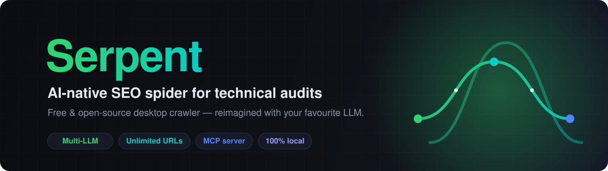
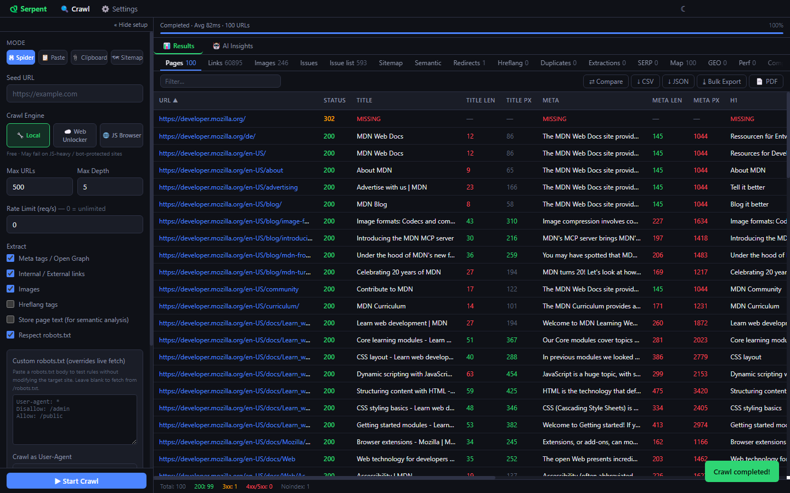
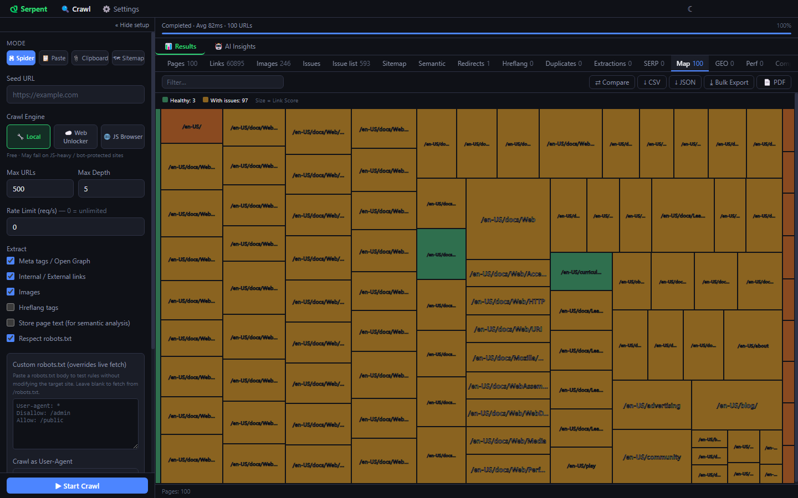
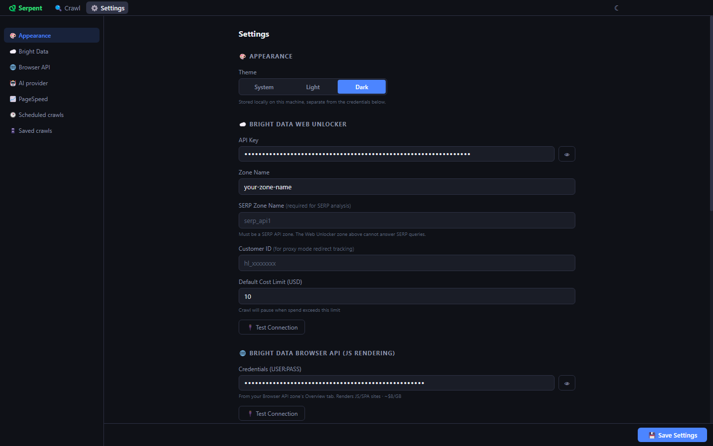
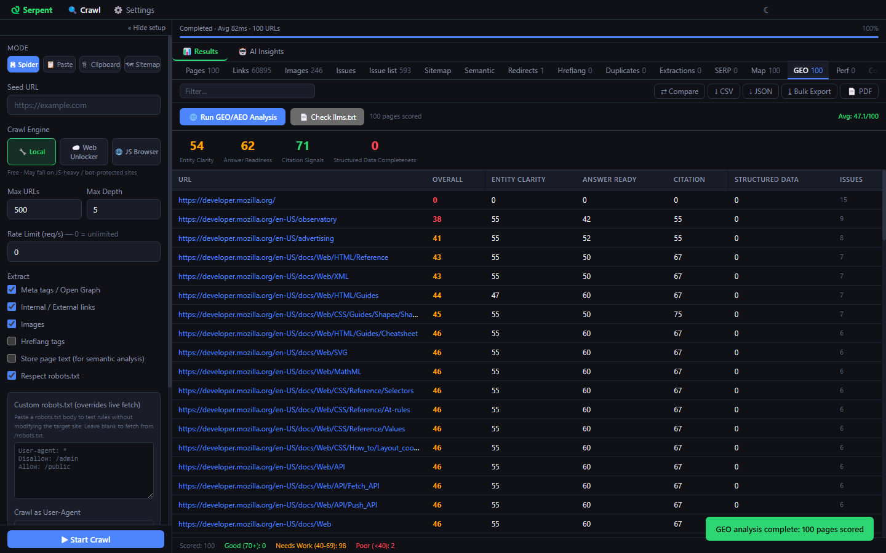
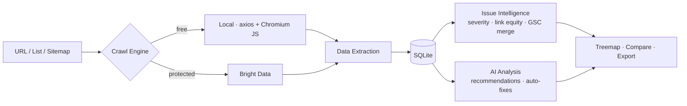

<div align="center">



<br/>

# Serpent 🐍

**The AI-native SEO spider for technical audits — free, open-source, and 100% local.**

Serpent is a desktop site crawler that brings enterprise-grade technical SEO auditing to your machine, with built-in AI analysis powered by *your* choice of LLM. A modern, open-source crawler — unlimited, cross-platform, and supercharged with AI.

<br/>

[](LICENSE)
[](https://github.com/danishashko/serpent/releases)
[](https://www.electronjs.org/)
[](https://www.typescriptlang.org/)
[](#-quick-start)
[](#contributing)

[**Download**](https://github.com/danishashko/serpent/releases) · [**Features**](#-features) · [**Quick Start**](#-quick-start) · [**Comparison**](#-how-serpent-compares) · [**MCP Server**](#-mcp-server) · [**Contributing**](#contributing)

</div>

---

## Why Serpent?

| | |
|---|---|
| 🧠 **AI-native** | Per-page analysis, severity-scored issues, and auto-generated title/meta fixes — bring your own key for OpenAI, Anthropic, Gemini, OpenRouter, or local Ollama. |
| 💸 **Genuinely free** | No URL caps, no license server, no subscription. MIT-licensed and unlimited. |
| 🔒 **100% local** | SQLite storage, OS-keychain secrets, zero telemetry. Your crawl data never leaves your machine. |
| 🛡️ **Crawls the un-crawlable** | Optional Bright Data integration bypasses bot protection; Electron's built-in Chromium renders JS — no separate browser required. |
| 🌐 **Built for AI search** | GEO/AEO readiness scoring per page, plus `llms.txt` validation — audit how answer engines read your site, not just how Google crawls it. |
| ♿ **Accessibility included** | Every crawl runs a static WCAG pass. No second tool, no extra request. |
| 🤖 **Agent-ready** | A built-in MCP server lets Claude Desktop (or any MCP client) drive crawls and query results directly. |

---

## Screenshots

| Crawl Results | Issues |
|---|---|
|  |  |

| Site Map (Treemap) | Settings |
|---|---|
|  |  |

| GEO / AEO Readiness |
|---|
|  |

---

## ✨ Features

<details open>
<summary><b>🕷️ Crawling</b></summary>

- **Local crawl engine** (axios) with configurable concurrency, depth, URL limits, and **per-request rate limiting**
- **Bright Data integration** to bypass bot protection on difficult sites
- **JavaScript rendering** via Electron's built-in Chromium — no headless browser needed
- **robots.txt** parsing and enforcement — the rule group follows the crawl User-Agent, so crawling as Googlebot obeys Googlebot's rules
- **Scoping modes** — full domain, single subdomain, start-folder only, or an exact **URL list** (paste, clipboard, sitemap, or file — across multiple domains)
- **Include / exclude URL patterns** (regex) and **URL parameter stripping** (`utm_*`, `fbclid`, …) to keep crawls focused and deduplicated
- **Configurable User-Agent** (Googlebot, Bingbot, Chrome presets or custom), **custom HTTP headers**, **HTTP Basic auth** (scoped to the host you entered it for — never forwarded across an off-host redirect), and **session cookies** for authenticated crawls
- **Scheduled crawls** — recurring local crawls that run while the app is open, with optional **auto-compare** that diffs each run against the previous one
- **Crawl retention** — optionally auto-delete crawls after 30/60/90 days, with a per-crawl lock to keep the ones that matter
- **Headless CLI mode** — `serpent --headless-crawl=<url> --output=pages.csv` crawls and exports without opening a window
- **Pause / Resume / Stop** with persistent crawl state and cost continuity
- **Crawl comparison** — diff any two crawls to see new, removed, and changed pages
</details>

<details>
<summary><b>🔍 SEO Extraction</b></summary>

- Title tags & meta descriptions (with pixel-width estimation)
- H1/H2 headings, canonical URLs, and indexability analysis (noindex, canonical, status codes)
- Internal & external link mapping with anchor text and `rel` attributes
- Image inventory — alt text, dimensions, format, and lazy-load detection
- Word count, page size, and text-to-HTML ratio
- **Redirect chain detection** — every hop with status codes
- **Duplicate content detection** — exact (SHA-256) and **near-duplicate** (64-bit simhash, ~90%+ similarity)
- **Uncrawlable link detection** — `<div href>`, `javascript:` hrefs, and onclick-only anchors that search engines can't reliably follow
- **HTML over 2MB** — Googlebot only reads the first 2MB of a document
- **Soft-404 detection** — 200-status pages whose content reads like an error page
- **Hreflang validation** — extracts and validates `hreflang`/`x-default`
- **Custom extraction** — pull any data with your own CSS selectors
- **Structured data / JSON-LD** — Schema.org type extraction + validation
- **Open Graph & Twitter Cards** — full social-tag extraction
- **Security headers** — HSTS, CSP, X-Frame-Options, X-Content-Type-Options
</details>

<details>
<summary><b>🧬 Semantic Analysis (embeddings)</b></summary>

Hashing catches pages that share wording. Embeddings catch pages that share *meaning* — the ones that actually cannibalise each other.

- **Semantically similar pages** — cosine similarity across the crawl with an adjustable threshold, so you can find two posts covering the same subject in completely different words
- **Low-relevance content** — pages measured against the site's centroid; the outliers are what's off-topic for this site
- **Semantic search** — query the crawl by meaning instead of keyword presence
- **Most representative page** — the page closest to the site's overall subject matter
- Vectors come from **Gemini, OpenAI, or local Ollama**, are L2-normalised, and are stored as 768-dim Float32 blobs (~3 KB/page)
- Works on full page text (enable **Store page text** before crawling) or on titles + meta descriptions for any existing crawl
</details>

<details>
<summary><b>🧠 AI Analysis (BYOK)</b></summary>

- **Multi-LLM support** — OpenAI · Anthropic · Google Gemini · OpenRouter · Ollama (local)
- Per-page SEO analysis with actionable recommendations
- **AI issue recommendations** — grouped, plain-English explanations + fix suggestions
- **Auto-generated fixes** — optimized titles & meta descriptions for problem pages
- Usage tracking with cost estimation
</details>

<details>
<summary><b>🌐 GEO / AEO — AI Search Readiness</b></summary>

Traditional crawlers score a page for Google's index. This scores it for the answer engines that read your page and quote it back to a user.

Every crawled page gets a **0-100 GEO score** across four axes:

- **Entity clarity** — is it obvious what and who this page is about, and are the entities named consistently?
- **Answer readiness** — does the page answer a question directly, in a passage that can be lifted and cited?
- **Citation signals** — the attribution surface: authorship, dates, sourcing, outbound evidence
- **Structured data completeness** — how much of the page's meaning is machine-readable rather than inferred

Plus **`llms.txt` validation** against the [llmstxt.org](https://llmstxt.org) proposal: whether the file exists, whether it is structurally valid (H1, blockquote summary, H2 link sections), whether `llms-full.txt` is published alongside it, and **which of its links your crawl never reached** — a link in `llms.txt` that a crawler cannot follow is one an LLM cannot fetch either.

</details>

<details>
<summary><b>♿ Accessibility (WCAG)</b></summary>

A static WCAG 2.2 pass runs on every crawled page, using the same parsed document as the SEO extractors — no second request, no render pass, no separate tool.

14 rules across four impact levels, using axe-core's rule ids and vocabulary so results line up with the tooling you already run:

| Impact | Rules |
|---|---|
| Critical | `image-alt` · `input-label` · `button-name` · `meta-viewport` |
| Serious | `link-name` · `html-has-lang` · `html-lang-valid` · `document-title` · `frame-title` · `tabindex-positive` · `th-has-data-cells` |
| Moderate | `heading-order` |
| Minor | `empty-heading` · `duplicate-id` |

Each page gets a 0-100 score weighted by impact and by the number of failing elements, surfaced as an **A11y** column in the Pages tab and rolled into the Issues tab under an **Accessibility** category.

> **Known limitation:** rules that need computed style or layout — **colour contrast above all** — cannot be evaluated from static markup and are not implemented. A page scoring 100 here has passed the static rules only; run a browser-based checker for contrast.

</details>

<details>
<summary><b>⚡ Performance Scoring</b></summary>

- **0-100 performance score** per page across TTFB, page size, image optimization, and content efficiency
- Complements the PageSpeed Insights integration — the score works on every page in the crawl, without burning PSI quota

</details>

<details>
<summary><b>🔭 Competitor Discovery & Content Gaps</b></summary>

- **Competitor discovery** via the Bright Data Discover API — find who else ranks in your space
- **Content gap analysis** — topics competitors cover that your crawl has no page for

</details>

<details>
<summary><b>📄 PDF Reports</b></summary>

Generate a client-ready PDF from any crawl, with selectable sections: executive summary, technical issues, content quality, performance, GEO readiness, internal links, structured data, security, and images.

</details>

<details>
<summary><b>📊 Issue Intelligence</b></summary>

- **Severity scoring** — Critical / Warning / Info / Opportunity
- **Prioritized issue list** — sorted by impact, color-coded by severity
- **Image optimization analysis** — missing dimensions, unoptimized formats, missing lazy-load
- **Internal link equity score** — PageRank-style algorithm to surface your most important pages
- **Core Web Vitals via PageSpeed Insights** — real Lighthouse lab metrics (LCP, CLS, TBT, FCP) plus CrUX field data (LCP, INP, CLS, FAST/AVERAGE/SLOW rating) per URL; keyless or with a free API key
</details>

<details>
<summary><b>🔗 Google Search Console & SERP</b></summary>

- **GSC OAuth 2.0** — import clicks, impressions, CTR, and average position per page
- **Orphan page detection** — find indexed pages your crawl never discovered
- **SERP analysis** — Google SERP scraping and competitor comparison via Bright Data
</details>

<details>
<summary><b>🗺️ Visualization & Reporting</b></summary>

- **Site treemap** — visual map sized by link equity, color-coded by issue severity
- **Crawl comparison** — side-by-side diff of new / removed / changed pages
- **Cost monitor** — real-time Bright Data spend, daily history chart, and hard-stop limits
- **SQLite** local storage (zero cloud dependency)
- **CSV & JSON export** with sortable, filterable tables across every results tab
</details>

---

## 🚀 Quick Start

> **Just want the app?** Grab a prebuilt installer from the [**Releases**](https://github.com/danishashko/serpent/releases) page — Windows `.exe`, macOS `.dmg` (Apple Silicon and Intel), Linux `.AppImage`.
>
> Builds are currently **unsigned** while the [SignPath Foundation](https://signpath.org) application is pending, so first launch needs one extra step:
> **Windows** — SmartScreen: *More info → Run anyway*. **macOS** — Gatekeeper: right-click → *Open*, then confirm. **Linux** — `chmod +x` the AppImage, and install `libsecret` (`libsecret-1-0` on Debian/Ubuntu, `libsecret` on Arch) which the OS keychain integration needs at startup.
> Every release ships SHA256 checksums and GitHub build provenance so you can verify the binary came from this repo. Every release page carries a *Verify this download* section with the exact commands.

### Run from source

**Prerequisites:** Node.js 20+ · npm · Git

```bash
git clone https://github.com/danishashko/serpent.git
cd serpent
npm install
npm run dev          # launch in development
```

### Build a distributable

```bash
npm run dist         # → ./release  (NSIS .exe / DMG / AppImage for your OS)
```

### First crawl in 30 seconds

1. Open the app and paste a URL into the crawl bar.
2. Pick an engine (**Local** is free; **Bright Data** for protected sites) and set depth/limits.
3. Hit **Start** — watch pages stream into the **Pages** tab live.
4. Open **Settings**, add an AI key, then click **Analyze** for severity-scored issues and fixes.
5. Open the **GEO** tab and hit **Run GEO/AEO Analysis** to score the crawl for AI search, and **Check llms.txt** to validate the file.
6. **Export** as CSV/JSON, or explore the **Treemap** and **Issues** tabs.

---

## ⚙️ Configuration

### AI providers (Bring Your Own Key)

Open **Settings** and paste a key for any provider. Keys are stored in your **OS keychain** via `keytar` — never in plain text, never sent anywhere but the provider.

| Provider | What you need | Local? |
|----------|---------------|:------:|
| OpenAI | API key from [platform.openai.com](https://platform.openai.com) | ❌ |
| Anthropic | API key from [console.anthropic.com](https://console.anthropic.com) | ❌ |
| Google Gemini | API key from [ai.google.dev](https://ai.google.dev) | ❌ |
| OpenRouter | API key from [openrouter.ai](https://openrouter.ai) | ❌ |
| Ollama | Install [Ollama](https://ollama.ai) and pull a model | ✅ |

### Bright Data (optional — for bot-protected sites)

1. Create a [Bright Data](https://brightdata.com) account.
2. Set up a **Web Unlocker** zone.
3. Enter your API key and zone name in **Settings**.

---

## 🧭 How It Works



1. **Configure** your crawl — URL, depth, concurrency, rate limit, extraction options.
2. **Crawl** with the local engine or Bright Data (pause/resume supported).
3. **Review** data across the results tabs — Pages, Links, Images, Issues, Issue list, Sitemap, Semantic, Redirects, Hreflang, Duplicates, Extractions, SERP, Map, GEO, Perf, Competitors and Gaps.
4. **Analyze** with your AI provider — severity-scored issues with fix suggestions.
5. **Score for AI search** in the GEO tab, check your `llms.txt`, then **visualize** as a treemap, compare crawls, and connect GSC for orphan-page detection.
6. **Export** results as CSV or JSON, or generate a client-ready PDF report.

---

## 🆚 How Serpent Compares

| Feature | Serpent | Typical Crawler |
|---------|:-------:|:--------------:|
| Price | **Free / Open Source** | Paid annual license |
| URL limit (free tier) | **Unlimited** | Capped |
| AI analysis | ✅ Multi-LLM (5 providers) | ❌ |
| AI issue recommendations + auto-fixes | ✅ | ❌ |
| Issue severity scoring | ✅ | ✅ |
| Structured data / JSON-LD | ✅ Extraction + validation | ✅ |
| Open Graph / Twitter Cards | ✅ | ✅ |
| Security headers | ✅ HSTS, CSP, X-Frame, X-Content-Type | ❌ |
| Google Search Console | ✅ OAuth + orphan detection | ✅ (paid) |
| Site visualization | ✅ Treemap with issue heat map | ❌ |
| Crawl comparison | ✅ | ✅ |
| Link equity / PageRank | ✅ Built-in scoring | ❌ |
| Redirect chains | ✅ | ✅ |
| Hreflang validation | ✅ | ✅ |
| Custom extraction | ✅ CSS selectors | ✅ CSS/XPath/Regex |
| Duplicate detection | ✅ Exact + near-duplicate (simhash) | ✅ Near-duplicate |
| Semantic similarity (embeddings) | ✅ Gemini / OpenAI / local Ollama | ✅ |
| Semantic search over a crawl | ✅ | ✅ |
| Uncrawlable link detection | ✅ | ✅ |
| JS rendering | ✅ Chromium built-in | ✅ (external browser) |
| Bot-protection bypass | ✅ Bright Data | ❌ |
| SERP analysis | ✅ Bright Data | ❌ |
| Cost monitoring | ✅ Real-time | N/A |
| GEO / AEO readiness scoring | ✅ 4-axis score per page | ❌ |
| `llms.txt` validation | ✅ Structure + link coverage | ❌ |
| Accessibility (WCAG) | ✅ 14 static rules, no contrast | ✅ axe-core, incl. contrast |
| Performance scoring | ✅ Built-in, no API quota | ✅ (Lighthouse/PSI) |
| Competitor discovery + content gaps | ✅ Bright Data | ❌ |
| PDF client reports | ✅ | ❌ |
| MCP server (AI agents) | ✅ | ✅ |
| Local data storage | ✅ SQLite | ✅ |
| Cross-platform | ✅ Win/Mac/Linux | ✅ Win/Mac/Linux |
| Open source | ✅ MIT | ❌ |

---

## 🤖 MCP Server

Serpent runs a built-in **Model Context Protocol** server at **`http://127.0.0.1:7777/mcp`** while the app is open. AI assistants like Claude Desktop can drive crawls and query results directly — no manual export.

### Available tools

| Tool | Description |
|------|-------------|
| `start_crawl` | Start a crawl by URL. Returns a `crawl_id`. |
| `stop_crawl` | Stop the currently running crawl. |
| `get_crawl_status` | Get live progress of the active crawl. |
| `list_crawls` | List all past crawls in the database. |
| `get_results` | Get page-level SEO data for a crawl (paginated). |
| `get_issues` | Get SEO issues grouped by severity. |
| `export_csv` | Export full crawl data as CSV text. |
| `get_links` | Get the internal link graph as source→target pairs with anchor text, for orphan pages and link equity. |
| `get_images` | Audit crawled images: missing alt text, format, lazy-loading status. |
| `get_settings` | Check which crawl engines and features are configured. |
| `set_settings` | Save Bright Data credentials so the `brightdata` engine becomes available. |

### Connect from Claude Desktop

Add this to `claude_desktop_config.json` (while Serpent is running) and restart Claude:

```json
{
  "mcpServers": {
    "serpent": {
      "type": "http",
      "url": "http://127.0.0.1:7777/mcp"
    }
  }
}
```

Config location — macOS: `~/Library/Application Support/Claude/claude_desktop_config.json` · Windows: `%APPDATA%\Claude\claude_desktop_config.json`

### Try it

```bash
# Start Serpent, then explore tools interactively:
npx @modelcontextprotocol/inspector http://127.0.0.1:7777/mcp
```

> 💬 *"Use Serpent to crawl https://example.com with max 50 URLs, then show me all critical SEO issues."*
> Claude chains `start_crawl` → `get_crawl_status` → `get_issues` automatically.

> 🔒 The MCP server only accepts connections from `127.0.0.1` and is never exposed to the network.

---

## 🛠️ Tech Stack

| Layer | Tools |
|-------|-------|
| Runtime | **Electron 35** (cross-platform desktop) |
| UI | **React 19** · **Vite 6** · **Recharts** |
| Language | **TypeScript 5.8** (main + renderer) |
| Data | **better-sqlite3** (embedded) |
| Crawl | **axios** · **cheerio** · **p-queue** |
| Security | **keytar** (OS keychain) · **zod** (validation) |
| Agents | **@modelcontextprotocol/sdk** |
| Testing | **Vitest** (unit) · **Playwright** (e2e) |

---

## 🗂️ Project Structure

```
serpent/
├── src/
│   ├── main/                        # Electron main process
│   │   ├── index.ts                 # Window creation, IPC handlers
│   │   ├── database.ts              # SQLite schema, queries, link scoring, comparison
│   │   ├── crawler-local.ts         # Local HTTP crawler + JS rendering
│   │   ├── crawler-brightdata.ts    # Bright Data crawler
│   │   ├── crawler-orchestrator.ts  # Crawl queue, scoping & rate limiting
│   │   ├── ai-analyzer.ts           # Multi-LLM analysis + issue recommendations
│   │   ├── embeddings.ts            # Vector embeddings + semantic similarity
│   │   ├── uncrawlable-links.ts     # Google crawlable-link guidance checks
│   │   ├── gsc-client.ts            # Google Search Console OAuth + analytics
│   │   ├── serp-client.ts           # SERP ranking via Bright Data
│   │   ├── cost-tracker.ts          # Bright Data spend monitoring
│   │   └── mcp-server.ts            # MCP HTTP server (port 7777)
│   ├── preload/index.ts             # IPC bridge (contextBridge)
│   ├── renderer/                    # React app (CrawlConfig, ResultsTabs, SiteMap, …)
│   ├── test/                        # Vitest unit suites
│   └── types/index.ts               # Shared TypeScript types
├── e2e/                             # Playwright end-to-end tests
├── package.json
└── docs/                            # README assets
```

---

## 🧪 Testing

```bash
npm test             # unit tests (Vitest)
npm run test:e2e     # end-to-end tests (Playwright, runs inside Electron)
```

> **Note:** `npm test` exercises the pure-logic suites under the system Node runtime. The DB-backed suites require the native `better-sqlite3` binary built for Electron's ABI and are covered by the Playwright e2e suite instead — that's expected, not a defect.

---

## Contributing

Contributions are welcome! Please open an issue first to discuss substantial changes.

1. Fork the repo
2. Create a feature branch — `git checkout -b feat/amazing-feature`
3. Commit — `git commit -m 'feat: add amazing feature'`
4. Push — `git push origin feat/amazing-feature`
5. Open a Pull Request

---

## License & Privacy

- **License:** [MIT](LICENSE) © 2026 [Daniel Shashko](https://organikpi.com)
- **Privacy:** [Privacy Policy](PRIVACY_POLICY.md) — Serpent collects **zero** user data. All processing is local.

---

## Code signing policy

Free code signing provided by [SignPath.io](https://about.signpath.io), certificate by [SignPath Foundation](https://signpath.org).

**Team roles**

| Role | Members |
|------|---------|
| Authors (commit without additional review) | [@danishashko](https://github.com/danishashko) |
| Reviewers (review all external pull requests) | [@danishashko](https://github.com/danishashko) |
| Approvers (approve each signing request) | [@danishashko](https://github.com/danishashko) |

Serpent is currently a single-maintainer project, so all three roles are held by the
same person. Every pull request from an outside contributor is reviewed before merge,
and every release is approved for signing individually.

**Privacy:** see the [Privacy Policy](PRIVACY_POLICY.md). Serpent will not transfer any
information to other networked systems unless specifically requested by the user or the
person installing or operating it. Optional integrations that do reach the network
(Bright Data, Google Search Console, and the OpenAI / Anthropic / Google / OpenRouter AI
providers) are off by default, require you to supply your own API key, and are listed
with their destinations in the Privacy Policy.

> **Status:** the SignPath Foundation application is pending. Until it is approved,
> release binaries are unsigned: Windows SmartScreen warns on first run, and macOS
> Gatekeeper refuses to open the app until you right-click → *Open*. SignPath signs
> Windows binaries only, so macOS and Linux builds stay unsigned either way.

---

## Author

**Daniel Shashko** — GTM Strategy × AI Automations

[](https://organikpi.com)
[](https://github.com/danishashko)

<div align="center"><sub>If Serpent saves you a pricey crawler license, consider giving it a ⭐.</sub></div>
